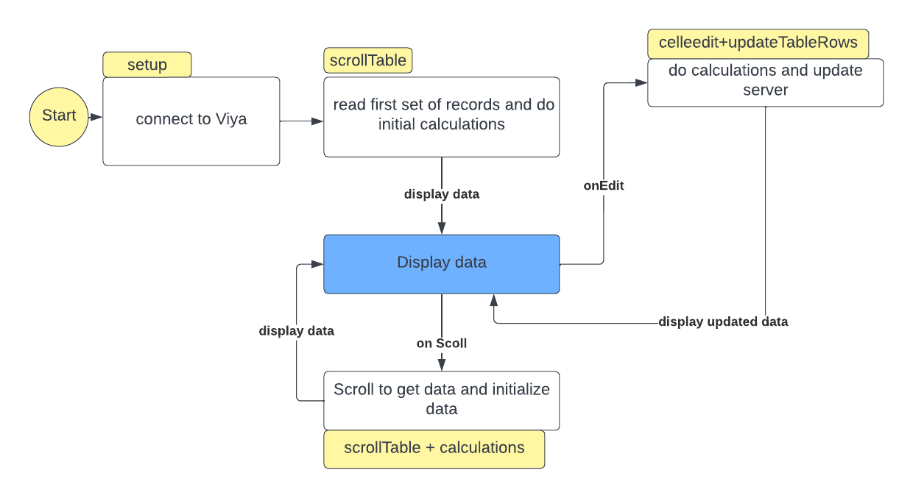

# editorapp  - Basic Data Entry Application for Viya using  @sassoftware/restafedit

- [Install](#install)
- [Requirements](#requirements)
- [Configuration](#config)
- [Usage](#usage)
- [CAS configuration](#casconfig)

This demo application uses plain old HTML to demonstrate the power and ease of use of
[@sassoftware/restafedit](https://sassoftware.github.io/restaf/restafedit/index.html).



## Install<a name="install"></a>

```sh
git clone https://github.com/sassoftware/restaf-uidemos -b editorapp editorapp
cd editorapp
npm install
```

## Requirements<a name="requirements"><a>

- Client set to clientapp with redirect of <https://localhost:5002/editorapp>
- Clientsecret set to secret
- load the ./data/testdata.csv into your casuser caslib

## Configuration<a name="config"></a>

Edit the .env file and set VIYA_SERVER to your Viya server URL

```env
VIYA_SERVER=https://myviyaserver
```

## Usage<a name="usage"></a>

For cas tables

```sh
npm start
```

For compute tables

```sh
npm run compute
```

And visit <https://localhost:5002/editorapp>

## Notes on CAS env settings<a name="casconfig"><a>

To access the CAS APIs your administraor has to set the TKHTTP_CORS_ALLOWED_ORIGINS for CAS as follows

1. Set your KUBECONFIG
2. Get a copy of the casdeployment custom resource file yaml:
kubectl get casdeployment default -o json > cas.json  

This command assumes your casdeployment name is ‘default’. If not default, use your casdeployment name from  the ‘kubectl get casdeployment’ command.

Instead of directly editing the cas.json file without having a backup copy, you might want to make a copy of the file. This way, if a mistake is made when editing, and CAS won’t re-deploy, you will have a copy of the original you can apply and not have to redo your whole Viya deployment.

3.If the environment variable TKHTTP_CORS_ALLOWED_ORIGINS does not exist in the json file, add it. If it does, modify it to for your purpose. Here is an example.

Find the place in the file where the environment variables for containers are specified. For example, find “name”: “SAS_LICENSE”. Here is a snippet.

"containers": [
{
    "env": [
        {
            "name": "SAS_LICENSE",
            "valueFrom": {
                "secretKeyRef": {
                    "key": "SAS_LICENSE",
                    "name": "sas-cas-license"
                }
            }
        },
        {
            "name": "CONSUL_HTTP_ADDR",
            "value": <https://localhost:8500>
        },

4.Add the TKHTTP_CORS_ALLOWED_ORIGINS env var below one of the env variables like so. If you add the new one as the last one, you won’t need the trailing comma of course.

"containers": [
{
"env": [
{
    "name": "SAS_LICENSE",
    "valueFrom": {
        "secretKeyRef": {
            "key": "SAS_LICENSE",
            "name": "sas-cas-license"
        }
    }
},
{
    "name": "CONSUL_HTTP_ADDR",
    "value": <https://localhost:8500>
},
{
    "name": "TKHTTP_CORS_ALLOWED_ORIGINS",
    "value": <https://localhost:5002,https://controller.sas-cas-server-default.cpq.svc.cluster.local:443,https://controller.sas-cas-server-default.cpq.svc.cluster.local:8777>
},

5.After saving your changes to cas.json, delete the casdeployment.
Kubectl delete casdeployment default    (Use your casdeployment name if it is not ‘default’.)

6.Wait for your casdeployment to go away such that
‘kubectl get casdeployment’ no longer shows your deployment.

7.Redeploy your casdeployment:
Kubectl create -f cas.json

8.Wait for your casdeployment to come up:
Kubectl get casdeployment shows your deployment again.
